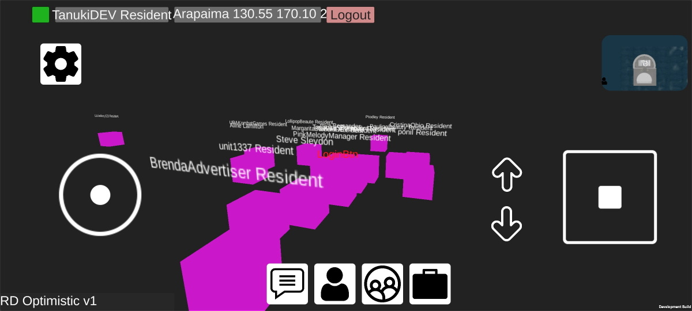
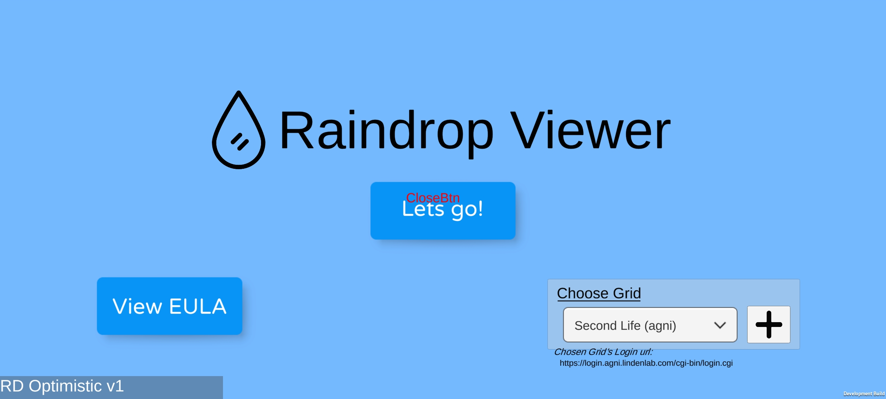
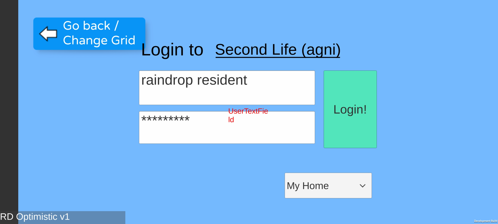
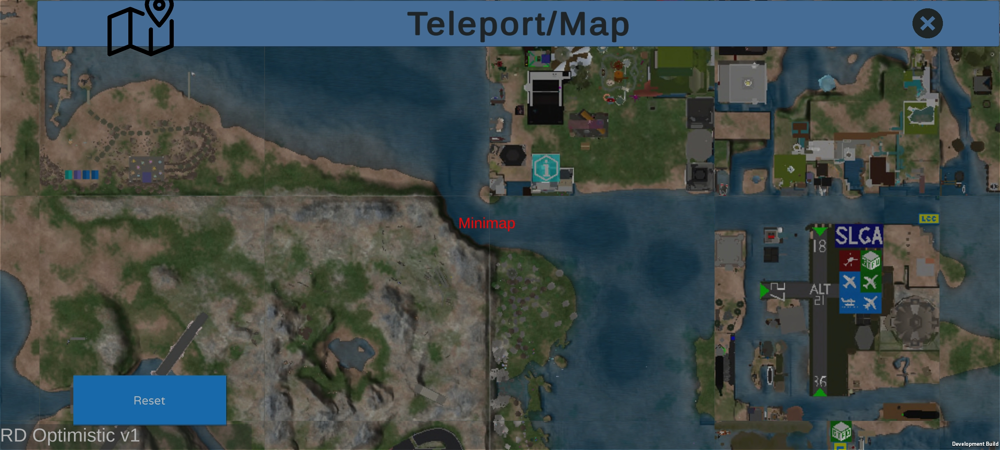

# Raindrop Viewer
An android client to connect to Secondlife and [OpenSimulator](http://opensimulator.org/wiki/Main_Page) grids, built on the Unity game engine.

This is experimental software.

## How to build/contribute?
Please see [Raindrop Viewer Documentation](docs/Readme.md)

## Development Screenshots

